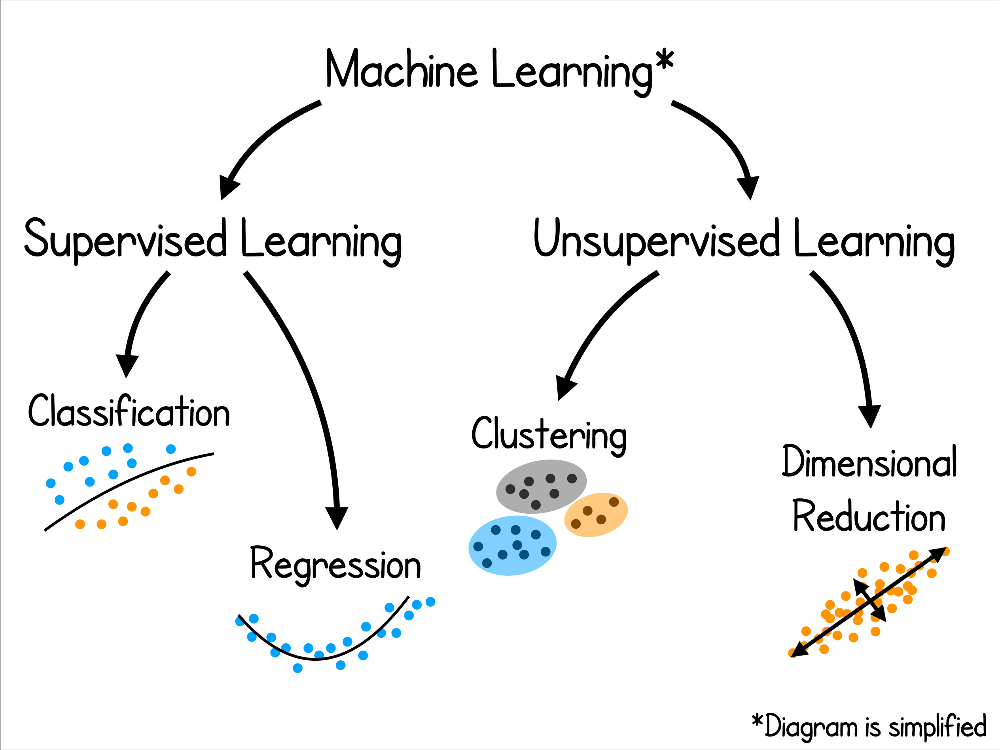

<section data-markdown>

## Welcome to AAPT Workshop W27

### Machine Learning and PER

*Supported by Michigan State University's College of Natural Science and The Lappan-Phillips Foundation.*

</section>

<section data-markdown>

### Workshop Facilitators

* Danny Caballero [caballero@pa.msu.edu](mailto:caballero@pa.msu.edu)
* Rachel Henderson [hende473@msu.edu](mailto:hende473@msu.edu)

[LML Tutorials Website](https://github.com/learningmachineslab/tutorials)

</section>


<section data-markdown>

## Introductions

* Name
* Institution
* Role
* Experience with ML
* Experience with Python

</section>

<section data-markdown>

### What do you want to use Machine Learning for?

[Google JamBoard](https://jamboard.google.com/d/18xCxRs7PLuf1Zbb0HClImXql8RHqVunD56YzBQ-BKbE/edit?usp=sharing)


</section>


<section data-markdown>

### What do we use Machine Learning for?

* Modeling assessment data
  * Finding structure in assessment data
* Modeling student degree attainment
  * Determining factors that influence attainment
* Modeling graduate admissions
  * Determining factors that predict admissions
* Developing language models of papers
  * Extracting themes from a paper collection

</section>

<section data-markdown>

### Today's workshop:

* Short introduction to the ML paradigm
* Guided tutorial to read, plot, analyze assessment data
* Comparative analysis using ML regression methods

</section>

<section data-markdown>

### Today's goals:

1. Develop a preliminary understanding of different ways to explore data using the ```pandas``` and ```matplotlib``` libraries
2. Become familiar with the ```model->train->score``` paradigm of ```sklearn```
3. Develop a preliminary understanding of the code implementations of ```sklearn``` for regression models
4. Develop a preliminary understanding of how to evaluate these models.

</section>

<section>


</section>

<section>



</section>

<section>


</section>

<section data-markdown>

### What does Machine Learning buy us (as education researchers)?

* Data we have access to is increasingly complex, large, and fundamentally relational
* Models from data science are able to handle a wider variety of data and predictions
* Data science frameworks for model construction, development, validation, and comparison are robust
* We can ask and answer new research questions

*Caveats: ML is not always the right tool for the job


Interpreting results from ML models can be a challenge*

</section>


<section>


</section>


<section>


</section>

<section data-markdown>

### Exploring Data Tutorial

We have collected assessment scores from students on a mechanics concept inventory.

For this tutorial, we will guide you through reading in, plotting, and deciding on research questions.

* [Link to Jupyter Notebook](https://github.com/learningmachineslab/tutorials/blob/master/exploring-data/data_exploration_tutorial.ipynb)
* [Link to Data](https://github.com/learningmachineslab/tutorials/raw/master/exploring-data/data/regression_data.csv)
* [Google JamBoard](https://jamboard.google.com/d/18xCxRs7PLuf1Zbb0HClImXql8RHqVunD56YzBQ-BKbE/edit?usp=sharing)


</section>

<section data-markdown>

### Regression Tutorial

With the same assessment scores, we will determine what factors contribute most in a model that predicts those scores.

We will also evaluate different models to try to understand how robust our findings are.

* [Link to Jupyter Notebook](https://github.com/learningmachineslab/tutorials/blob/master/regression/regression.ipynb)
* [Link to Data](https://raw.githubusercontent.com/learningmachineslab/tutorials/master/regression/data/regression_data.csv)
* [Google JamBoard](https://jamboard.google.com/d/18xCxRs7PLuf1Zbb0HClImXql8RHqVunD56YzBQ-BKbE/edit?usp=sharing)

[Regression Methods in Python](https://scikit-learn.org/stable/supervised_learning.html#supervised-learning)

</section>

<section data-markdown>

## Thank you!

### Contact information

* Danny Caballero [caballero@pa.msu.edu](mailto:caballero@pa.msu.edu)
* Rachel Henderson [hende473@msu.edu](mailto:hende473@msu.edu)

[LML Tutorials Website](https://github.com/learningmachineslab/tutorials)

</section>
